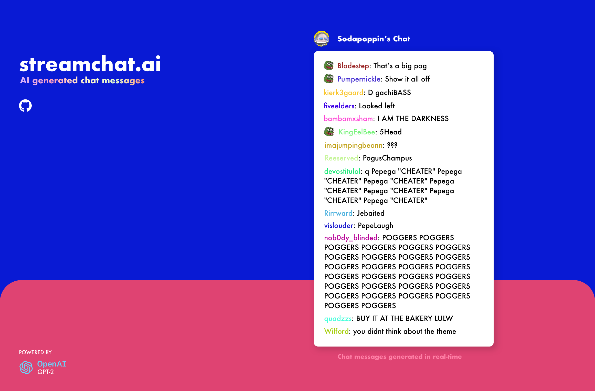

# streamchat.ai - Training a transformer model (GPT-2) on livestream chat messages

Project Status: Unable to generate meaningful messages.

The Jupiter Notebook shows a step-by-step of project progress.

First a tokenizer was trained with the dataset.

## Potential reasons for failure

The reason for model failure is most likely due to using the wrong type of model for the job.

From my current understanding, transformers are most effective at predicting sequences of words.

This is at odds with the dataset which contains many single word datapoints.

## Scripts

`compile_chatlogs.py`:
Iterates through raw .txt files and cleans up Twitch chat data.

-   Removes chatter's username + timestamp
-   Adds `<BOS>` and `<EOS>` symbols to each message

`create_datasets.py`:
Uses sklearn's builtins to split apart compiled chat data into train/test/validate datasets.
